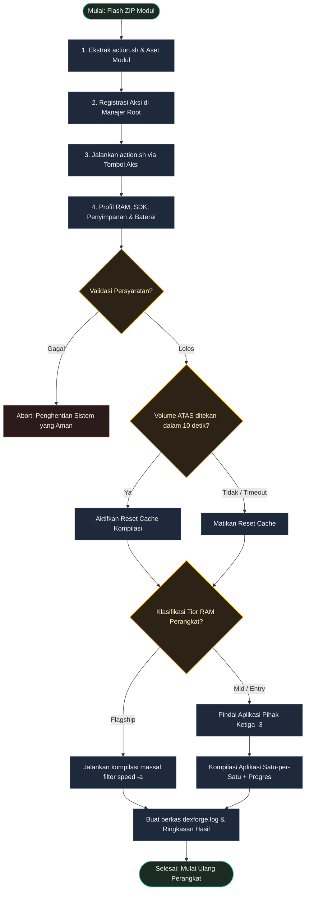

[English](README.md) | [Bahasa Indonesia](README.id.md)

# DexForge

**Optimalkan kompilasi DEX/ART Android secara dinamis berdasarkan spesifikasi hardware perangkat Anda.**


## Deskripsi Umum

DexForge adalah modul root yang secara dinamis mengoptimalkan kompilasi DEX/ART Android. Modul ini menganalisis RAM dan versi Android Anda untuk memilih filter kompilasi terbaik, meningkatkan kelancaran sistem tanpa membebani hardware berspesifikasi rendah.

---

## Mengapa Memilih DexForge?

- **Performa yang Disesuaikan**: Memilih otomatis filter kompilasi terbaik (`speed`, `speed-profile`, atau `quicken`) sesuai kapasitas RAM perangkat.
- **Proteksi Keamanan**: Memeriksa daya baterai dan sisa ruang penyimpanan secara aktif sebelum berjalan untuk menghindari error.
- **Reset Cache Opsional**: Memungkinkan pembersihan cache kompilasi sebelum optimasi dimulai jika Anda ingin segar dari awal.

---

## Persyaratan Sistem

| Persyaratan | Detail |
|-------------|--------|
| Android | 7.0+ (API 24+) |
| Penyimpanan | Sisa penyimpanan minimal 512MB pada partisi `/data` |
| Baterai | Kapasitas minimal 15% (diabaikan jika perangkat sedang diisi daya) |
| Root | Magisk v20.4+, KernelSU, atau APatch |

---

## Instalasi & Konfigurasi

1. Pasang berkas ZIP modul melalui tab **Modules** di manajer root Anda (Magisk, KernelSU, atau APatch).
2. Jalankan kompilasi melalui tab **Action** di manajer root Anda.
3. **Reboot** (Mulai ulang) perangkat Anda untuk menerapkan kompilasi runtime secara penuh.
4. Periksa log eksekusi di: `/data/adb/modules/DexForge/dexforge.log`

---

## Penggunaan

### Konfigurasi Kompilasi Interaktif
Saat Anda menjalankan script aksi DexForge, Anda akan diminta menekan tombol fisik perangkat:
* Tekan **Volume ATAS** untuk membersihkan cache kompilasi dan melakukan optimasi bersih.
* Tekan **Volume BAWAH** (atau tunggu 10 detik) untuk mengkompilasi data yang ada secara bertahap.

### Simulasi Dry-Run (Developer CLI)
Mengaudit luaran compiler modul tanpa menulis data fisik ke penyimpanan (membutuhkan root shell):
```sh
su
/data/adb/modules/DexForge/action.sh --dry-run
```

---

## Struktur Berkas

```text
DexForge/
├── META-INF/
│   └── com/
│       └── google/
│           └── android/
│               ├── update-binary
│               └── updater-script
├── action.sh        # mesin utama pemilihan dan eksekusi kompilasi
├── customize.sh     # pemasangan dan konfigurasi saat modul diinstal
├── module.prop      # properti metadata modul
├── service.sh       # stub layanan booting
├── uninstall.sh     # mereset cache filter kompilasi dan menghapus log
└── update.json      # konfigurasi metadata pembaruan
```

---

## Cara Kerja



---

## Pengembang & Lisensi

- **Pengembang**: [dyokism](https://github.com/dyokism)
- **Lisensi**: MIT
