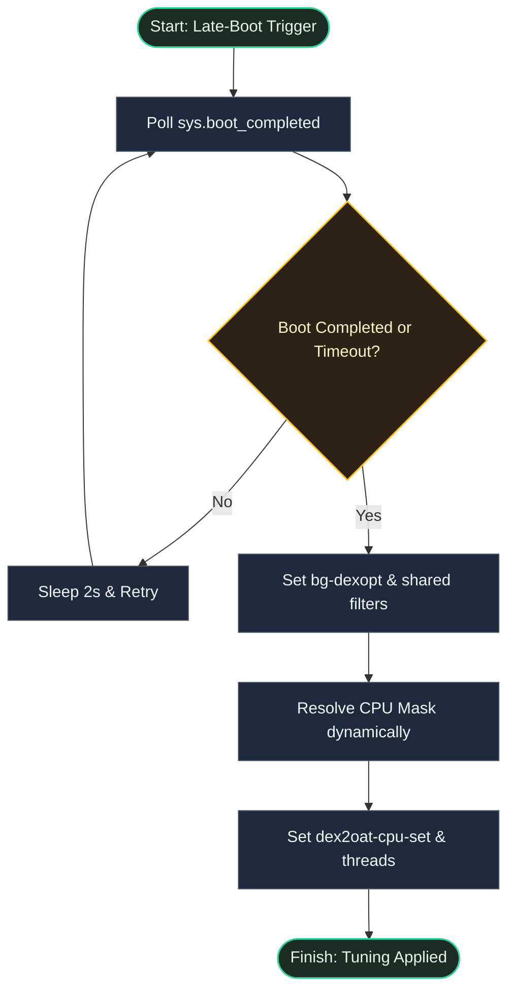
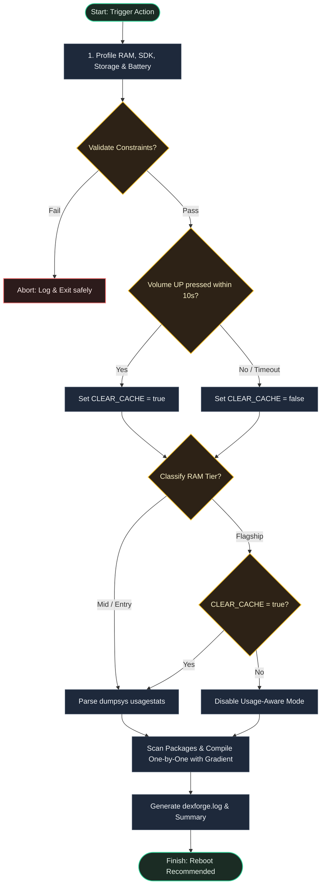

# DexForge

<p align="center">
  
</p>

<p align="center">
  <strong>Optimize Android DEX/ART compilations dynamically based on your device hardware.</strong>
</p>

<p align="center">
  
  
  
  
  <br>
  <br>
  <a href="README.md">English</a> | <a href="README.id.md">Bahasa Indonesia</a>
</p>

## Overview

DexForge is a cross-platform Android root module designed to dynamically optimize the system's DEX/ART compilations. By profiling the device's RAM tier, SDK level, battery state, and available storage during execution, DexForge automatically assigns the most appropriate compilation filter—ranging from `speed` for flagship devices to `speed-profile` or `quicken`/`verify` for entry and mid-tier hardware based on a dynamic usage-aware priority gradient. This hardware-aware profiling ensures that app launch times are minimized and system fluidity is maximized without overloading lower-spec devices.

---

## Why Use DexForge?

- **Tailored Performance**: Automatically selects the best compiler filter (`speed`, `speed-profile`, or `verify`/`quicken`) based on your device's RAM capacity and app usage statistics.
- **Safety Guards**: Actively checks battery level and storage space before running to prevent errors.
- **Interactive Cache Reset**: Lets you optionally purge compilation caches before optimization to start fresh.

---

## How to Use

### 1. Installation & Setup
* Download the latest `DexForge.zip` from [Releases](https://github.com/dyokism/DexForge/releases).
* Install the ZIP file via your root manager's **Modules** tab (Magisk, KernelSU, or APatch).
* **Reboot** your device to fully initialize the background services and core thread watchdog.

### 2. Execution (Action Button)
* Launch the compilation engine by pressing the **Action** button in your root manager's menu.
* **Interactive Cache Prompt**: During start-up, press **Volume UP** to perform a clean reforge (purges existing compiler caches first) or **Volume DOWN** (or wait 10 seconds) to compile existing states incrementally.
* Optimization results and execution events are logged at: `/data/adb/modules/DexForge/dexforge.log`

### 3. Dry-Run Audit Mode (CLI)
* To simulate execution and verify compiler selection without performing physical writes, run the CLI utility in a root shell:
  ```sh
  su
  /data/adb/modules/DexForge/action.sh --dry-run
  ```

---

## Technical Details

### Hardware-Based Classification & Usage-Aware Priority
* **Flagship Tier (> 6144 MB RAM)**: Compiles all system and user packages using individual tracking loops (preventing CPU locks) targeting the `speed` filter. During full runs (`CLEAR_CACHE=true`), it applies a usage-aware gradient where unused packages are set to `speed-profile`. During incremental runs, it skips usagestats parsing to maximize execution speed.
* **Mid Tier (3072 MB - 6144 MB RAM)**: Assigns a usage-aware filter gradient where top used apps get `speed`, normal apps get `speed-profile`, and unused apps get `verify` (or `quicken` on older Android versions) to prevent OOM failures and storage exhaustion.
* **Entry Tier (<= 3072 MB RAM)**: Limits compilation to `speed-profile` for top apps and `verify`/`quicken` for the rest to conserve CPU and storage.

### System Safety Validation Protocols
* **Storage Failsafe**: Verifies contiguous free space on the `/data` partition. If available storage is under **512MB**, compilation terminates to prevent bootloops.
* **Battery Failsafe**: Queries battery status via PMIC sysfs metrics with fallback to `dumpsys battery`. Execution is blocked if the device is not charging and capacity is under **15%**.

### Late-Boot Core Regulation (`service.sh`)
* **Dynamic Core Affinity**: Watchdog dynamically resolves the lower half of logical cores on boot completion (handling prime-first CPU topologies safely) and restricts background compiler threads (`dalvik.vm.dex2oat-cpu-set` and `dalvik.vm.dex2oat-threads`) to LITTLE efficiency cores to prevent CPU thermal throttling and user interface lag.

---

## Requirements

| Requirement | Details |
|-------------|---------|
| Android | 7.0+ (API 24+) |
| Storage | Minimum 512MB free space on `/data` partition |
| Battery | Minimum 15% charge capacity (waived if actively charging) |
| Root | Magisk v20.4+, KernelSU, or APatch |

---

## File Structure

```text
DexForge/
├── META-INF/
│   └── com/
│       └── google/
│           └── android/
│               ├── update-binary
│               └── updater-script
├── action.sh        # core compiler selection and execution engine
├── changelog.md     # changelog tracking module version updates
├── customize.sh     # install-time setup and configuration
├── module.prop      # module metadata properties
├── service.sh       # late boot completion optimizer & thread regulator
├── uninstall.sh     # clean up persistent data on uninstall
└── update.json      # update metadata configuration
```

---

## How It Works

### Scenario A: Late-Boot Core Regulator (`service.sh`)



### Scenario B: Manual Optimization Engine (`action.sh`)



---

## Developer, Credits & License

- **Developer**: [dyokism](https://github.com/dyokism)
- **License**: [MIT](LICENSE)
- **Credits & Acknowledgements**:
  - **Android Runtime (ART)** by [Google](https://source.android.com/devices/tech/dalvik)
  - **Root Managers**: [Magisk](https://github.com/topjohnwu/Magisk), [KernelSU](https://github.com/tiann/KernelSU), and [APatch](https://github.com/bmax121/APatch)
