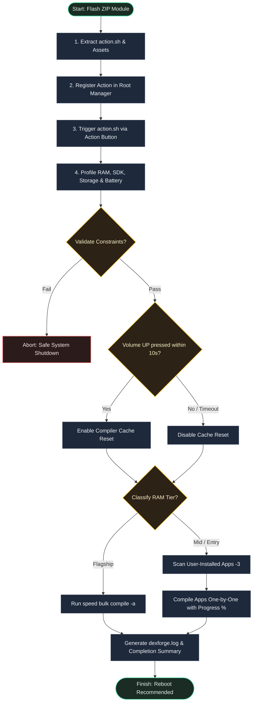

# DexForge

<p align="center">
  
</p>

<p align="center">
  <strong>Optimize Android DEX/ART compilations dynamically based on your device hardware.</strong>
</p>

<p align="center">
  
  
  
  
  <br>
  <br>
  <a href="README.md">English</a> | <a href="README.id.md">Bahasa Indonesia</a>
</p>

## Overview

DexForge is a cross-platform Android root module designed to dynamically optimize the system's DEX/ART compilations. By profiling the device's RAM tier, SDK level, battery state, and available storage during execution, DexForge automatically assigns the most appropriate compilation filter—ranging from `speed` for flagship devices to `speed-profile` or `quicken` for entry and mid-tier hardware. This hardware-aware profiling ensures that app launch times are minimized and system fluidity is maximized without overloading lower-spec devices.

---

## Why Use DexForge?

- **Tailored Performance**: Automatically selects the best compiler filter (`speed`, `speed-profile`, or `quicken`) based on your device's RAM capacity.
- **Safety Guards**: Actively checks battery level and storage space before running to prevent errors.
- **Interactive Cache Reset**: Lets you optionally purge compilation caches before optimization to start fresh.

---

## How to Use

### 1. Installation & Setup
* Download the latest `DexForge.zip` from [Releases](https://github.com/dyokism/DexForge/releases).
* Install the ZIP file via your root manager's **Modules** tab (Magisk, KernelSU, or APatch).
* **Reboot** your device to fully initialize the background services and core thread watchdog.

### 2. Execution (Action Button)
* Launch the compilation engine by pressing the **Action** button in your root manager's menu.
* **Interactive Cache Prompt**: During start-up, press **Volume UP** to perform a clean reforge (purges existing compiler caches first) or **Volume DOWN** (or wait 10 seconds) to compile existing states incrementally.
* Optimization results and execution events are logged at: `/data/adb/modules/DexForge/dexforge.log`

### 3. Dry-Run Audit Mode (CLI)
* To simulate execution and verify compiler selection without performing physical writes, run the CLI utility in a root shell:
  ```sh
  su
  /data/adb/modules/DexForge/action.sh --dry-run
  ```

---

## Technical Details

### Hardware-Based Classification
* **Flagship Tier (> 6144 MB RAM)**: Assigns the `speed` filter (unconditional AOT machine code compilation) for maximum CPU efficiency.
* **Mid Tier (3072 MB - 6144 MB RAM)**: Assigns the `speed-profile` filter (Profile-Guided Optimization). It acts as a protective wrapper, overriding requests for full `speed` compilation to protect the system from storage exhaustion and virtual memory out-of-memory (OOM) failures. If profile data is insufficient, it safely falls back to `verify` (API >= 31) or `quicken` (API < 31).
* **Entry Tier (<= 3072 MB RAM)**: Assigns the `verify` filter (API >= 31) or `quicken` filter (API < 31) to keep the non-volatile storage footprint minimal and prevent physical RAM pressure.

### System Safety Validation Protocols
* **Storage Failsafe**: Verifies contiguous free space on the `/data` partition using standard POSIX white-space tokenization over `df -k` output. If available storage is under **512MB**, compilation terminates to prevent filesystem corruption and bootloops.
* **Battery Failsafe**: Queries PMIC sysfs metrics `/sys/class/power_supply/battery/` with an automated fallback to the `dumpsys battery` binder service. Execution is blocked if the device is not charging and the capacity is under **15%**.

### Late-Boot Core Regulation (`service.sh`)
* **Core Affinity Pinning**: Spawns an early-boot polling watchdog that hooks onto `sys.boot_completed`. Upon boot completion, it configures system properties (`dalvik.vm.dex2oat-cpu-set=0,1,2,3` and `dalvik.vm.dex2oat-threads=4`) to restrict background compiler operations to logical efficiency cores. This prevents CPU thermal throttling and maintains system responsiveness.

---

## Requirements

| Requirement | Details |
|-------------|---------|
| Android | 7.0+ (API 24+) |
| Storage | Minimum 512MB free space on `/data` partition |
| Battery | Minimum 15% charge capacity (waived if actively charging) |
| Root | Magisk v20.4+, KernelSU, or APatch |

---

## File Structure

```text
DexForge/
├── META-INF/
│   └── com/
│       └── google/
│           └── android/
│               ├── update-binary
│               └── updater-script
├── action.sh        # core compiler selection and execution engine
├── changelog.md     # changelog tracking module version updates
├── customize.sh     # install-time setup and configuration
├── module.prop      # module metadata properties
├── service.sh       # late boot completion optimizer & thread regulator
├── uninstall.sh     # clean up persistent data on uninstall
└── update.json      # update metadata configuration
```

---

## How It Works



---

## Developer, Credits & License

- **Developer**: [dyokism](https://github.com/dyokism)
- **License**: [MIT](LICENSE)
- **Credits & Acknowledgements**:
  - **Android Runtime (ART)** by [Google](https://source.android.com/devices/tech/dalvik)
  - **Root Managers**: [Magisk](https://github.com/topjohnwu/Magisk), [KernelSU](https://github.com/tiann/KernelSU), and [APatch](https://github.com/bmax121/APatch)
